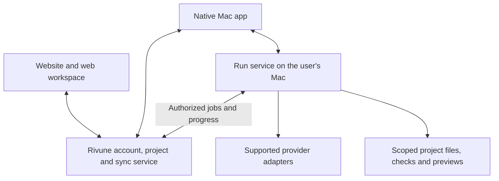

# ADR-001: Connect Rivune web, desktop, and local execution

**Status:** Accepted for implementation; local workspace milestone built
**Date:** September 4, 2026
**Decision owner:** Aarav

## Context

**Implementation update:** The user authorized building this direction. See [Connected workspace build](CONNECTED_WORKSPACE_BUILD.md) for the implemented local run coordinator, native/browser connection and static project workflow. The source inventory below records the pre-implementation baseline; the hosted identity/sync diagram remains the target, not a completed cloud service.

Rivune should let someone discover the product on its website, sign in, open the native Mac app, connect supported intelligence, complete a task, and return to the same work from either interface. Its advantage should be demonstrably useful delivery with low management effort. Visual polish and a long provider list alone do not establish that advantage.

There are two related integrations: the product website/web workspace with the native app, and a generated project's development server with an inspectable preview. They need different mechanisms.

Current source inspection establishes:

- [website/app/product-demo.tsx](../website/app/product-demo.tsx) advances prewritten responses; it is a demonstration, not a connected client.
- [ProviderRegistry.swift](../Rivune/ProviderRegistry.swift) already separates catalog configuration from reviewed runtime adapters. Codex and Claude are the implemented pair.
- [TerminalAIService.swift](../Rivune/TerminalAIService.swift) executes bounded text requests with tools disabled. Project editing, checks and development servers are not implemented in this path.
- [RivuneCollaborationRunner.swift](../Rivune/RivuneCollaborationRunner.swift) is shared across local, phone and evaluation paths, but still depends on store helpers and a main-actor callback.
- [RivuneStore.swift](../Rivune/RivuneStore.swift) owns UI state, running tasks, local JSON history and an in-memory duplicate-request cache. Changing conversation cancels a local run; disconnecting the bridge cancels remote jobs.
- [PeerBridge.swift](../Rivune/PeerBridge.swift) is a paired Bonjour/TLS transport for Apple devices, not a browser API or cloud synchronization service.

This ADR records the decision. The [connected workspace build](CONNECTED_WORKSPACE_BUILD.md) records current runtime behavior and remaining boundaries.

## Decision

Keep the native SwiftUI app. Extract a shared Swift product core and a local run service. Add a small web workspace and managed account/project service using the same versioned contracts. Keep provider credentials and local project execution on the user's Mac initially.

The diagram is the proposed target. The hosted service, browser client, independent runner and project executor are not currently present as this integrated system.

### Product surfaces

| Surface | Responsibility |
|---|---|
| Public website | Explain the outcome, show an honest demo, provide downloads, documentation and sign-in. Keep it visually aligned with the app. |
| Signed-in web workspace | Show synchronized projects, conversations, task status and uploaded results; open the exact task in the Mac app. Later, submit work to an authorized online device. |
| Native Mac app | Connect supported CLIs/APIs, choose local project folders, work with files and previews, and manage local execution permissions. |
| Account/project service | Identity, device registration, project membership, selected content synchronization, durable job delivery and event subscriptions. |
| Local run service | Own processes, provider adapters, durable run state, cancellation, permissions, artifact references and actual check results. |

The website and native app share identity and work records; they need not share UI source code. Reuse design tokens, language, icons and domain contracts across React and SwiftUI. Preserve native keyboard, window and file-picker behavior.

### Account and device flow

Use a managed account service initially; **Supabase Auth/Postgres/Storage is the recommended starting option**, subject to the owner configuring the project. It supports Google sign-in for web and native clients and provides database authorization primitives. This proposal does not create an account or select a paid plan. [Google sign-in documentation](https://supabase.com/docs/guides/auth/social-login/auth-google), [row-level security](https://supabase.com/docs/guides/database/postgres/row-level-security)

The website and Mac app authenticate independently into the same Rivune user identity. Use supported system-browser authentication with state/PKCE and registered callbacks; do not copy browser session cookies or embed a client secret in the app. An “Open in Rivune” link carries a project or task identifier, not a provider credential or shell command. The app reauthorizes access before opening it. [Google desktop flow](https://developers.google.com/identity/protocols/oauth2/native-app), [Apple authentication session](https://developer.apple.com/documentation/authenticationservices/aswebauthenticationsession), [associated domains](https://developer.apple.com/documentation/xcode/supporting-associated-domains)

Register each execution device explicitly. A future remote connection should be outbound from the Mac, tied to that account/device, and revocable. Web requests identify an authorized workspace and a supported operation; the Mac enforces its local permission scope. Being signed into Google does not itself authorize remote filesystem execution or connect a model provider.

### Execution ownership and shared contracts

Create a UI-independent core for capability records, prompts, collaboration policy and result validation. Extract process/run ownership from `RivuneStore` so changing screens does not cancel work. Use a local transactional journal, with a tested migration from current conversation JSON; preserve existing IDs and backups.

The minimum shared contract should distinguish:

- `Project`: identity, membership, shared instructions and sync policy.
- `Conversation`: belongs to a project or personal workspace.
- `Connection`: provider, access method, execution device, capability version and readiness; no secret values.
- `Run`: request ID, conversation, selected connection IDs, input revision, permission scope and state.
- `RunEvent`: run ID, monotonic sequence, type, timestamp and source. Clients reconnect using the last received sequence.
- `Artifact`: origin run, file/revision identity, content type, storage scope and optional preview.
- `CheckResult`: command/test identity, inspected revision, exit status and evidence location. Agent review is a separate record.

Use stable request IDs to deduplicate submission. Persist acknowledgement, process identity, completion and cancellation. Reconnecting must not automatically replay a side-effecting command whose outcome is uncertain; surface recovery-required state. A durable ledger reduces duplicate execution risk but is not a universal exactly-once guarantee.

The desktop can talk to the runner through a local transport. The web receives authorized jobs/events through the service. The old phone bridge can remain during migration; it should eventually use the same domain commands without pretending its current pairing protocol is cloud sync.

### Data and execution location

| Data/capability | Initial home |
|---|---|
| Rivune account and project membership | Hosted account/project service |
| Synced conversation content, progress and selected results | Hosted storage only for projects/content the user chooses to synchronize |
| CLI login material and local API keys | Provider-owned storage or Mac Keychain; never copied into cloud project rows |
| Repository, raw terminal logs and working files | Mac by default; explicit uploads are separate |
| Local model server and MCP tools | Named device and explicit capability scope |
| Cloud-only API execution | Later worker service with separately authorized credentials/billing; not reuse of a desktop subscription login |

Show the execution location, such as “This Mac · Online.” When the Mac sleeps or goes offline, the website can show the last synced result and an honest offline state. It cannot continue a local CLI task by itself. Background work after closing the UI requires a deliberately installed/managed helper; closed UI, offline device and stopped run are different states.

### Project work and previews

Add a workspace executor rather than removing the current text-mode restrictions globally. A development run receives an approved folder and a bounded plan. Parallel writers need explicit file ownership or isolated worktrees, followed by integration and review of the same revision.

The runner records changed files, runs configured checks, and starts a development server as an owned process. Register its actual address and readiness. The native preview can display it locally; a web preview requires an authenticated device tunnel or a separately uploaded/static artifact. Viewing a preview does not mean the website has been deployed publicly.

Completion should show the result with optional Preview / Files / Changes / Activity views. Use equivalent document/source views for writing and research. Counts and test badges come from run evidence, never merely from generated prose.

## What competitors establish

- **Clopen:** its browser connects to the host that owns SQLite, agents, terminals and files. Reopening a browser accesses that running workspace; it is not replication between separate installations. Borrow backend-owned execution and explicit engine state. [Architecture decisions](https://github.com/myrialabs/clopen/blob/main/DECISIONS.md), [engine layer](https://github.com/myrialabs/clopen/tree/main/backend/engine)
- **LobeHub:** desktop authorization/server access and local-device execution use separate connections. This supports the same split for Rivune. Current canary source migrates legacy local storage mode to cloud, so older offline/sync descriptions should not be used as a blanket guarantee. [Desktop connection](https://github.com/lobehub/lobehub/blob/canary/docs/self-hosting/advanced/desktop.mdx), [device gateway](https://github.com/lobehub/lobehub/blob/be3d4c53d5df6af3906954af5789219b950227b3/apps/desktop/src/main/services/gatewayConnectionSrv.ts), [configuration migration](https://github.com/lobehub/lobehub/blob/be3d4c53d5df6af3906954af5789219b950227b3/apps/desktop/src/main/controllers/RemoteServerConfigCtr.ts)
- **The Cog:** messaging and role-targeted tasks are useful coordination patterns. Rivune still needs bounded task ownership, durable recovery and artifact/check evidence around them. See [the verified reference notes](CLI_ORCHESTRATOR_REFERENCES.md).

These were official source/documentation inspections, not deployed runtime parity tests.

## Options and trade-offs

| Option | Complexity and cost | Consequence |
|---|---|---|
| **Keep SwiftUI + shared contracts + local runner + small cloud service** | Moderate; maintains two renderers and operates an account/sync service | Recommended. Preserves existing native investment, local execution and a connected web experience. |
| Rebuild the desktop around the web UI | Large initial migration; more UI code reuse afterward | Loses immediate reuse of the native UI and requires revalidating desktop behavior. Sharing UI code still does not solve process ownership or synchronization. |
| Expose only a local web workspace | Smallest initial backend footprint; depends on one reachable host | Useful engineering milestone, but insufficient alone for a public account portal and cross-device project continuity. |

The initial stack should remain small: SwiftUI/Swift core/runner, React/Next.js for web, a thin typed API, and managed identity/Postgres/storage. No separate service per agent. Add cloud workers only when a real web-only use case justifies their operational and model costs.

## How to prove Rivune is better

Start with a reachable audience: Mac users already using Codex or Claude Code to build small websites. Compare the same tasks against direct use of their best single provider and one relevant integrated tool. Include simple tasks where a team may add no value.

Measure setup completion, accepted task completion, hands-on user time, total time to a usable result, defects found by independent checks, and model usage/cost where actually reported. Report unavailable usage rather than inventing it. Blind the final-output evaluation where practical and disclose the small sample. Winning a small pilot does not establish universal superiority.

The product should choose direct execution for straightforward work and add review when it can improve the outcome. Let users see the selected team and usage budget. Keep disagreement, failures and unchecked claims inspectable; team agreement is not a correctness metric.

## Action items and acceptance gates

1. **Extract the run service locally.** Preserve current text behavior and IDs. Verify changing conversations, restarting the UI, cancellation and reconnect do not duplicate or silently discard work.
2. **Connect identity and task handoff.** Website sign-in → open the exact native task → register the device → connect one supported provider. Validate account mismatch, expired login and revoked device behavior.
3. **Complete one real development task.** Choose a small local project; produce an actual change, run a configured check, obtain second-provider review of that revision, and present a usable result. Keep direct mode functional.
4. **Synchronize selected work.** Show that same run/result on the website. Verify event replay, access boundaries, offline-device messaging and no implicit upload of the full repository or provider credentials.
5. **Run a small comparative pilot.** Use repeatable tasks and record user effort, success, elapsed time and available usage. Fix the largest failure before adding providers.
6. **Expand only behind capabilities.** API workers, additional CLIs, MCP and internet control each need implemented adapters, scoped execution and their own end-to-end checks.

The first connected demonstration should be: **sign in on the website → open Rivune → connect a provider → finish one real project change → see the same result online**. This is the next delivery target, not a statement that the integration is already built.
